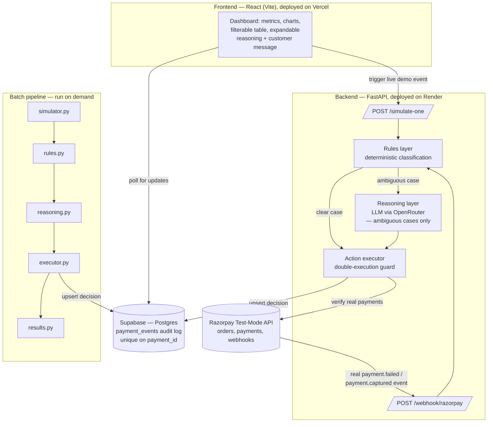

# PayResQ — AI-Powered Payment Recovery Agent

**🔗 Live dashboard:** https://payment-recovery-agent-two.vercel.app

**🔗 Live backend:** https://payresq-backend.onrender.com

Built for Razorpay's AI Buildathon (Track 03)

## The problem

When a UPI/card payment is disrupted mid-transaction, a customer's money can be debited without the merchant's system getting clean confirmation. Razorpay calls this a **late authorization** — the payment sits in an ambiguous state for up to 3 days before resolving. Naive systems either retry too early (risking a double charge) or leave the customer anxious with no explanation.

PayResQ detects these ambiguous/failed payment states, reasons about the right response per case, executes it, notifies the customer honestly, and logs every decision for a full audit trail — live, not just in a batch.

## Beyond the batch — a live, reactive system

- **Not just a batch classifier.** A real FastAPI backend receives actual Razorpay webhook events (`payment.failed`, `payment.captured`), verifies their signature, and runs them through the full pipeline automatically — no manual trigger needed.
- **The dashboard is genuinely live**, not a static mockup. A "Simulate a live payment" panel lets anyone trigger a real event through the deployed backend and watch it get classified, reasoned about, and logged in real time.
- **The LLM never acts directly.** It only proposes a diagnosis (action + reasoning) for genuinely ambiguous cases; a separate deterministic layer decides whether to execute, with a double-execution guard.
- **Two real bugs were found and fixed during development, not hidden:**
  1. An early reasoning-layer prompt caused every ambiguous case to default to the same action regardless of context. Fixed by adding explicit decision rules (retry_count and customer-history thresholds) to the prompt.
  2. Razorpay's webhook retries caused duplicate rows for the same payment. Fixed with a Supabase `upsert` on `payment_id` plus a unique constraint.

## Architecture

Payment event (webhook or simulated) → **Classify** (deterministic rules for clear cases) → **Reason** (LLM, only for genuinely ambiguous cases) → **Act** (bounded, gated execution — auto-retry / wait-and-reassure / notify / escalate) → **Log** (Supabase audit trail: classification, action, internal reasoning, customer-facing message, timestamp)

## Results (full batch run)

Ran the complete pipeline on an 82-event batch — 80 simulated Razorpay-style payment events plus real Razorpay test-mode payments verified live via the API and webhook.

- **₹ At risk:** ₹1,30,906.13 (updates live as new events are simulated on the deployed dashboard)
- **₹ Recovered** (safely auto-retried): ₹21,139.18
- **₹ Unresolved** (correctly held for customer action, escalation, or late-auth wait): ₹1,09,766.95
- **Escalated to merchant for human review:** 4+ cases
- **Correctly held back from acting** (no premature retry): 13 cases
- **Late-authorization cases handled** (the core scenario this project targets): 8
- **Ambiguous cases resolved via LLM reasoning:** 10, including real Razorpay test payments

## Tech stack

- **Backend:** Python + FastAPI, deployed on Render
- **Frontend:** React (Vite), deployed on Vercel
- **Payments:** Razorpay test-mode API + real webhook integration (HMAC-verified)
- **Reasoning:** LLM via OpenRouter, used selectively — only for ambiguous cases
- **Audit log:** Supabase (Postgres) — queryable, with real-time-capable schema
- **Charts:** Recharts (classification breakdown, status distribution)

## Live demo — try it yourself

1. Open the live dashboard: https://payment-recovery-agent-two.vercel.app
2. Use the "Simulate a live payment" panel — enter an amount, pick an outcome (or leave as "Success"), click **Trigger event**
3. Watch the new row appear in the table with a live highlight, fully classified and reasoned
4. Click any row to expand and see both the customer-facing message and the internal audit reasoning side by side

## Setup (local development)

### Backend
1. `cd backend && python -m venv venv`, activate it
2. `pip install requests python-dotenv fastapi uvicorn supabase`
3. Create `.env` in `backend/` with: `RAZORPAY_KEY_ID`, `RAZORPAY_KEY_SECRET`, `RAZORPAY_WEBHOOK_SECRET`, `SUPABASE_URL`, `SUPABASE_ANON_KEY`, `OPENROUTER_API_KEY`
4. In Supabase, create a `payment_events` table (see schema below) with RLS policies allowing `SELECT`, `INSERT`, `UPDATE` for the `anon` role, and a unique constraint on `payment_id`
5. Run the pipeline: `python simulator.py` → `python rules.py` → `python reasoning.py` → `python executor.py` → `python results.py`
6. To run the live webhook server locally: `uvicorn main:app --reload`

### Frontend
1. `cd frontend && npm install`
2. Create `.env` in `frontend/` with `VITE_SUPABASE_URL`, `VITE_SUPABASE_ANON_KEY`, `VITE_API_URL` (your backend URL)
3. `npm run dev`

### Database schema (`payment_events`)
`payment_id` (unique), `amount`, `status`, `error_code`, `error_description`, `error_reason`, `customer_id`, `retry_count`, `classification`, `action_taken`, `reasoning`, `customer_message`, `executed_at`, plus auto `id`/`created_at`.

## Real bugs, found and fixed

This wasn't a first-try build — two real issues surfaced during development and were fixed with evidence, not just claimed.

1. **Bug 1 — the reasoning layer defaulted to the same action regardless of context.**

     Before the fix, every ambiguous case landed on `notify_customer_action_required`, no matter what the retry count or customer history looked like:

    `pay_sim_0077 (card_declined, retry_count=0)` -> notify_customer_action_required
   
    `pay_sim_0078 (payment_failed, retry_count=2)` -> notify_customer_action_required
   
    `pay_sim_0073 (card_declined, retry_count=1)` -> notify_customer_action_required
   

     The LLM had the context (retry_count, customer history) but wasn't weighting it — it was pattern-matching to one generic answer. Fixed by adding explicit decision rules to the prompt (e.g. "if retry_count >= 2, lean toward escalation"). After the fix, the same case correctly diverges:

    `pay_sim_0078 (payment_failed, retry_count=2)` -> escalate_to_merchant

     reasoning: Retry count of 2 meets the threshold for repeated failures, indicating a pattern that warrants escalation to the merchant for human review.

3. **Bug 2 — duplicate audit log entries from Razorpay webhook retries.**

     Razorpay retries webhook delivery when it doesn't receive a fast, clear response. This caused the same real payment to be inserted into the audit log              multiple times — no error was thrown, since a plain `insert` with no uniqueness constraint silently accepted every duplicate. Confirmed via Supabase: one          real payment (`pay_TXhNwnlKD5NzN7`) was logged **4 times**.

   Fixed by switching from `insert` to `upsert` keyed on `payment_id`, with a unique constraint added on that column in Supabase. Verified by re-triggering a real payment failure (`pay_TXha3YUrJ2ebZY`) — the webhook fired twice (Razorpay's normal retry behavior, outside this system's control), but the audit log correctly shows exactly one row:

    `Webhook processed: pay_TXha3YUrJ2ebZY -> [REAL API] action=notify_customer_action_required | Verified via Razorpay API: status=failed, captured=False
     INFO: 52.66.76.63:0 - "POST /webhook/razorpay HTTP/1.1" 200 OK
     Webhook processed: pay_TXha3YUrJ2ebZY -> [REAL API] action=notify_customer_action_required | Verified via Razorpay API: status=failed, captured=False
     INFO: 52.66.76.63:0 - "POST /webhook/razorpay HTTP/1.1" 200 OK`

## Non-goals (deliberately out of scope)

- Fraud detection, subscription/mandate dunning (Razorpay already has an Intelligent Retry Engine for this), multi-currency, production-grade auth/dashboard roles.
